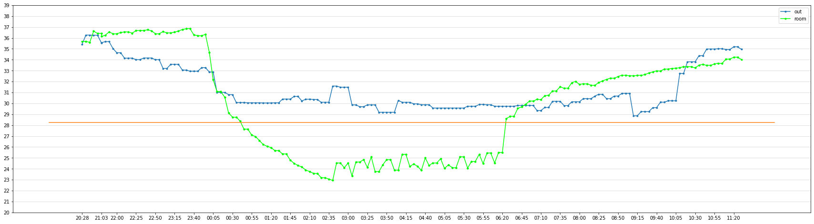
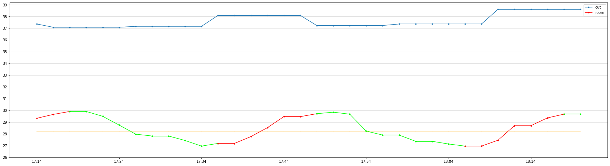

### AirController

AirController è un sistema intelligente di controllo automatico per condizionatori che hanno rotto (o non hanno) un sensore di temperatura/umidità (quindi portano sempre la temperatura/umidità a livelli minimi possibili).
L'obbiettivo è gestire il condizionatore attraverso segnali inviati tramite infrarossi.
AirController riceve in input un indice di calore come target (HUMIDEX) e il suo obbiettivo sarà mantenere costante questo indice.
il controller si basa su diversi fattori:
- Temperatura/Umidità esterna (chiamate API a openWeather).
- Temperatura/Umidità interna (DHT22/DHT11).
- Numero di persone nella stanza (AM312).
- Errore assoluto che può commettere il condizionatore.

Altri componenti utilizzati:
- 2 diodi a infrarossi a LED (emissione e ricezione).
- ESP32 con Display per mostrare i parametri della stanza.
- 3 ESP8266

Tutti i dati (temperatura, unimdità, indice di calore, conta persone ecc...) saranno inviati ad un server MQTT per la sincronizzazione dei vari ESP8266 e per la raccolta dei dati, per stabilire (attraverso analisi) se effettivamente c'è un risparmio di corrente e di salute.

*Licenza Scelta*: GPLv3

*Senza l'utilizzo di AirController*

*Con l'utilizzo di AirController*

